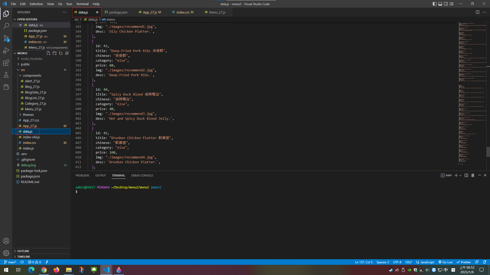
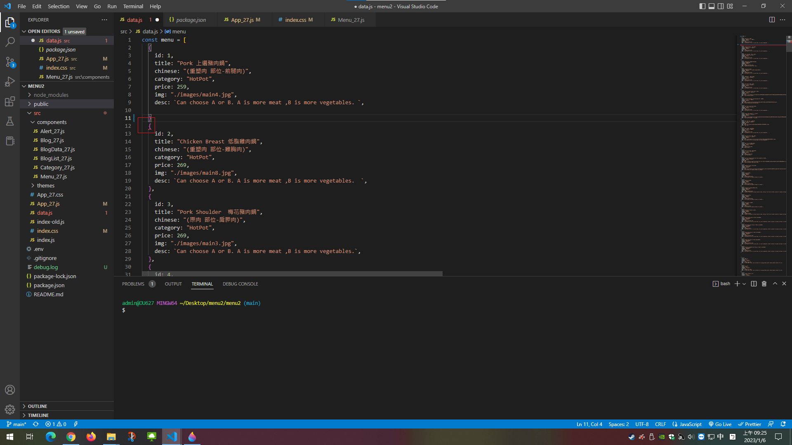
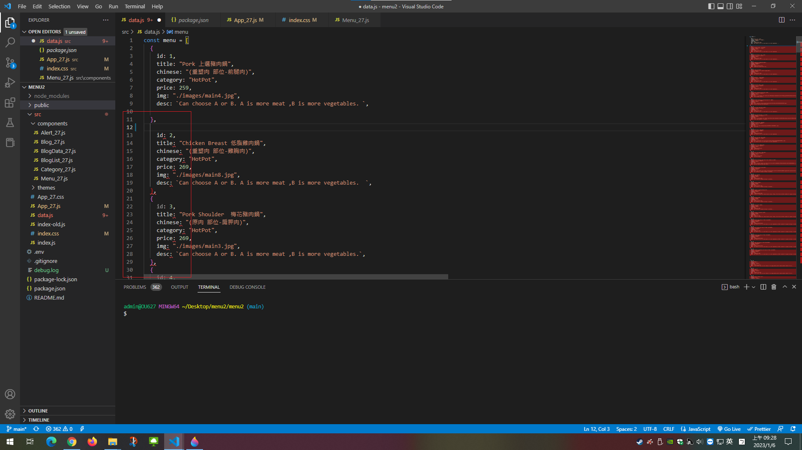
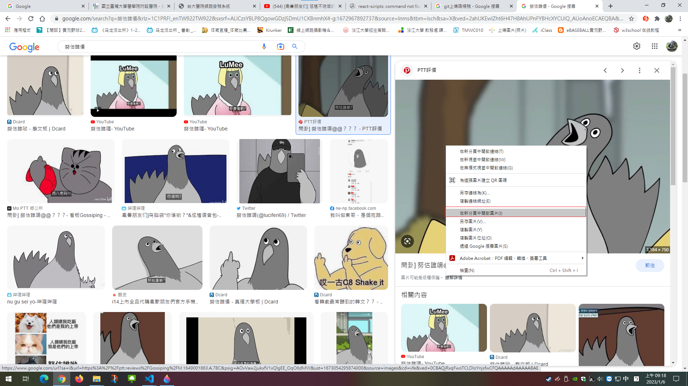
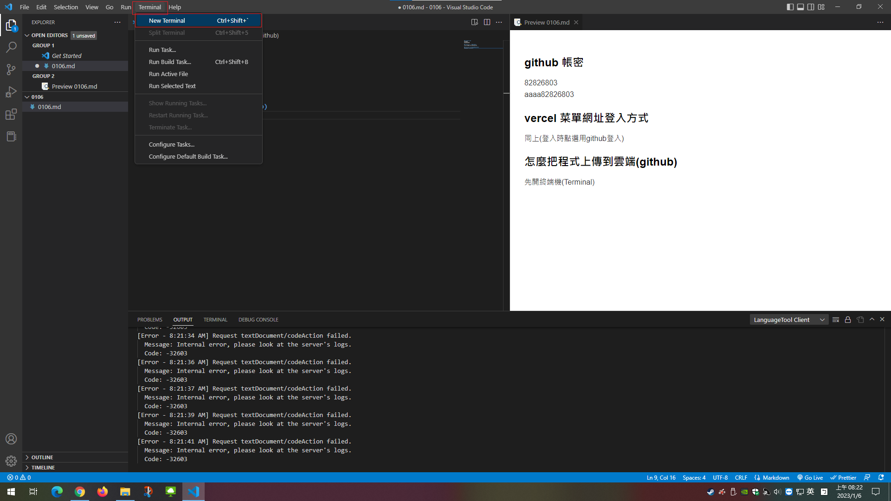
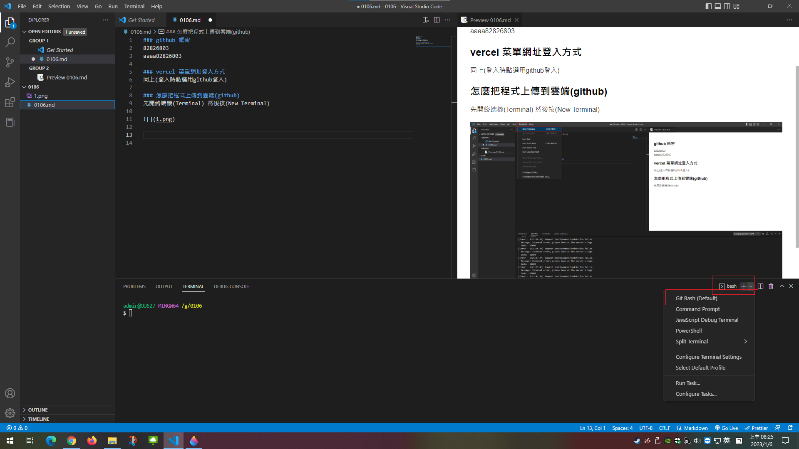

### github 帳密
82826803
aaaa82826803

### vercel 菜單網址登入方式
同上(登入時點選用github登入)

### data資料要怎麼改
改檔案資料的時候 
切記 切記 切記 給我看清楚!!!!
改data.js這個檔案就好

萬一你非常不幸改到其他檔案然後網站沒辦法跑了 在跟我說
然後記得 如果改檔案的時候看到紅色毛毛蟲(如下圖) 代表你的格式不對(通常應該是少加括號或逗號)
記得要檢查 沒檢查然後有錯就傳上去高機率會出事





一個資料的格式如下
```
{
    id: 1,
    title: "Pork 上選豬肉鍋",
    chinese: "(重塑肉 部位-前腿肉)",
    category: "HotPot",
    price: 259,
    img: "./images/main4.jpg",
    desc: `Can choose A or B. A is more meat ,B is more vegetables. `,
    
  },
```
id=資料編號(不是很重要的東西 不過你最好還是按照順序排吧)
title=肉品名稱(前面打英文後面打中文)
chinese=肉的部位以及是原肉還是重塑
category=菜單最上面的選單功能(如果是主鍋就打hotpot 附餐就打sideMeal 單點就打else )
price=價錢
img=照片(說明看下面)
desc=商品說明(可以打可以選a餐或b餐 )

```
關於照片 如果你是用拍的 照片要存在public裡面的image(檔案路徑為菜單->menu->public->images)
改檔案的時候就像下面這樣寫
img: "./images/main4.jpg",
如果你是從網路上抓的圖片 可以用圖片網址的方式
img: "https://greensupply.com.tw/file/user/product/594prodImg20180823033006_1.jpg",

```
在網路上看到的照片要怎麼找到那張圖片的網址呢?
首先先對圖片按滑鼠右鍵 然後選在新分頁開啟圖片

就結束了


### 怎麼把程式上傳到雲端(github) 可以看.env檔
先開終端機(Terminal) 然後按(New Terminal) 可以按快捷鍵ctrl+shift+`(鍵盤左上角那個鍵)



然後切到Git bash如下圖



切到Git bash 之後開始下指令 
指令順序如下

1. git status
2. git add .
3. git commit -m "隨便你打 可以打1就好"
4. git push

請注意 如果打完第3行跳出很多英文 裡面應該會有下面這2行字

```
$ git config --global  user.name "使用者名稱"
$ git config --global  user.email "使用者電子郵件"
```

這個時候再把下面這2行打進去就好
```
$ git config --global  user.name "82826803"
$ git config --global  user.email "a82826803@gmail.com"
```

如果多打了這2行 指令順序就會如下
1. git status
2. git add .
3. git commit -m "隨便你打 可以打1就好"
4. git config --global  user.name "82826803"
5. git config --global  user.email "a82826803@gmail.com"
6. git commit -m "隨便你打 可以打1就好"
7. git push

如果你上傳之後想在更改一些東西上傳 沒意外的話下這3個指令就好 有意外看上面
1. git add .
2. git commit -m "隨便你打 可以打1就好"
3. git push